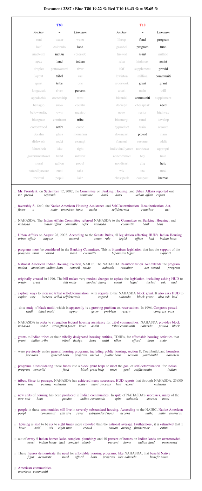

# CTAWG LDA wrapper



```
## stm v1.1.3 (2016-01-14) successfully loaded. See ?stm for help.
```

In this vignette we demonstrate a practical approach to topic model analysis from start to finish. We wish both to demonstrate the elements of this approach to text analysis in the abstract and to provide practical tools for fitting your own models with your own data. While some aspects of the workflow are data specific, i.e. you may need to construct your own data importer, we provide functions in a logical sequence that if followed helps you not only estimate by understand your topic model. While topic modeling is considered by some to be a form of unsupervised machine learning, we think this is a mistake. This workflow treats topic modeling as a form of computer assisted human learning, and thus you will be asked to perform qualitative cross validation. Simply we believe that topic modeling is not a substite for your own reading of texts, but rather a research assistant that can improve the speed and accuracy of your content analysis.

#The Idea of a Topic Model

Topic modeling is a way of theoretically conceptualizing and empirically estimating a process by which authors "write" documents, or, in a more true to method characterization, how authors draw on different available vocabularies for communicating. Topic modeling does not model ideas, but how words hang together in clusters, and how authors draw on those clusters to compose texts. Topic modeling is often associated with a method of estimation called LDA, or latent Dirichelet allocation. An LDA style model has two components:

 - A *document by topic* matrix of probabilities, which describes generically how words in a text are in aggregate distributed across a set of topics. This is often scaled such that each document's vector of topic probabilities sums to one. 
 - A *topic by term* matrix of probabilities, which describes how each topic is composed of particular words, normally scaled so a topic's word vector sums to one. Simulation of a text from this matrix would represent the word frequency distribution of the "average document" in the corpus.
 - From these two basic elements the joint probability that a particular word in a particular document is drawn from a particular topic is given by the *topic by document by token* array. Here each document is represented as a *topic by token* matrix that sums to one, and represents how the total population of term-instances (tokens) in a given text is distributed across topic origins.

Theoretically, each token comes from only a single topic. Empirically, the topical origin of any given token, a word in a text, is a matter of great uncertainty, since in a typical topic model it has a nontrivial chance of coming from several topics. This is the "L" in LDA, as it is assumed that the process of document creation, the choice of a topic and then a word, is hidden from us, as we only observed the text as a finished product. Note that even in our own software naming conventions we tend to use "word" rather than the more precise "term" and "token". We hope the meaning is clear from context.


#The 107th Congressional Record

As a case study we have a record of floor speeches from the 107th Congress covering nearly the entire calender years 2001 and 2002. While these texts are public record, we exploit an [ICPSR project by Mathew Gentzko and Jesse Shapiro](http://www.icpsr.umich.edu/icpsrweb/ICPSR/studies/33501) that matches the speeches with identifying information about the speakers who were congresspeople. We have parsed the original text delimited databases into an R data frame.

#Install

Installing `stm` with dependencies and suggestions will also install other important packages, namely `tm` and `SnowballC`. `data.table` is a high performance analogue to `data.frame` that allows scalable and memory efficient operations. Only the first line of packages are necessary. The full text annotator relies only on base R graphics, however if you want to play with the extended visualizations then you'll need to install the second line of packages as well.


```r
if(F){
	# for topic model
	install.packages(c('stm','data.table'))
	
	# for extra visualization tools https://github.com/cpsievert/LDAvis
	install.packages(c('devtools','network','shiny','LDAvis','servr'))
}
```


#Import

Load ICPSR data.

```r
load("107th Congressional Record (ICPSR).RData")
str(icpsr.cong107,max.level = 3,list.len = 5)
```

```
## List of 3
##  $ GPOspeech_107.txt:'data.frame':	145453 obs. of  2 variables:
##   ..$ speechID: chr [1:145453] "10720010000001" "10720010000002" "10720010000003" "10720010000004" ...
##   ..$ speech  : chr [1:145453] "The pending business is the question of suspending the rules and passing the bill, H.R. 2234, as amended." "The question is on the motion offered by the gentleman from Maryland that the House suspend the rules and pass the bill, H.R. 2"| __truncated__ "Mr. Speaker, due to complications with my voting card I was recorded as not voting in rollcall No. 3 on January 23, 2002. I ask"| __truncated__ "Mr. Speaker, during rollcall vote No. 3 on January 23, 2002 I was unavoidably detained. Had I been present, I would have voted "| __truncated__ ...
##  $ 107SpeakerID.txt :'data.frame':	552 obs. of  6 variables:
##   ..$ id      : int [1:552] 107001 107002 107003 107004 107005 107006 107007 107008 107009 107010 ...
##   ..$ state   : Factor w/ 51 levels "","AK","AL","AR",..: 3 3 3 3 3 3 3 3 3 2 ...
##   ..$ name    : Factor w/ 549 levels "Adam Putnam",..: 483 504 46 441 56 485 135 227 435 127 ...
##   ..$ chamber : Factor w/ 3 levels "","H","S": 2 2 2 2 2 2 2 3 3 2 ...
##   ..$ district: Factor w/ 54 levels "","1","10","11",..: 2 13 24 35 46 50 51 1 1 54 ...
##   .. [list output truncated]
##  $ GPOdescr_107.txt :'data.frame':	145453 obs. of  10 variables:
##   ..$ speechID             : num [1:145453] 1.07e+13 1.07e+13 1.07e+13 1.07e+13 1.07e+13 ...
##   ..$ date                 : int [1:145453] 10103 10103 10103 10103 10103 10103 10103 10103 10103 10103 ...
##   ..$ num_order_within_file: int [1:145453] 1 2 3 1 1 1 2 3 4 5 ...
##   ..$ speakerID            : int [1:145453] 107900 107900 107900 107900 107900 107900 107400 107900 107486 107900 ...
##   ..$ file                 : chr [1:145453] "Hcr03ja01-45 1.txt" "Hcr03ja01-45 1.txt" "Hcr03ja01-45 1.txt" "Hcr03ja01-46 1.txt" ...
##   .. [list output truncated]
```

Pre-processing according to stm defaults.

```r
icpsr2stmbow<-icpsr2stmbow.f(
	icpsr.cong107
	,sample.size=10000
	,out.dir = od
	,save.to.disk=std
	,check.for.saved.output=T
)
```

```
## Warning: Loading and returning first saved icpsr2stmbow-samp10000.RData
```

```r
samp<-browse.icpsr(
	icpsr = icpsr.cong107
	,speechID = names(icpsr2stmbow$documents)
)
str(icpsr2stmbow,max.level = 3,list.len = 5)
```

```
## List of 4
##  $ documents   :List of 9990
##   ..$ 10720020029581: int [1:2, 1:29] 99 1 321 1 570 1 1479 1 1941 1 ...
##   ..$ 10720010037279: int [1:2, 1:2] 8455 1 10693 1
##   ..$ 10720020018309: int [1:2, 1:5] 4273 1 5846 1 6650 1 7173 1 10602 1
##   ..$ 10720020052501: int [1:2, 1:3] 6511 1 6650 1 10611 1
##   ..$ 10720020064108: int [1:2, 1:8] 188 2 3612 1 6511 1 6650 1 7284 2 ...
##   .. [list output truncated]
##  $ vocab       : chr [1:10768] "aaron" "aarp" "aba" "aback" ...
##  $ meta        : NULL
##  $ docs.removed: int [1:10] 658 1593 2013 4356 4654 5702 6625 6756 7843 8807
##  - attr(*, "class")= chr "textProcesser"
```

An alternate format for original document recovery.

```r
ftxt2stmbow<-ftxt2stmbow.f(
	string=samp$speech
	,save.to.disk=std
	,check.for.saved.output=cfso
	,out.dir = od
)
```

```
## Warning: Loading and returning first saved ftxt2stmbow.RData
```


#Model

```r
stmbow2lda<-stmbow2lda.f(
	stmbow=ftxt2stmbow
	,out.dir=od
	,k=100
	,alpha=NULL
	,visualize.results=T
	,verbose=F
	,save.to.disk=std
	,check.for.saved.output=cfso
)
```

```
## Warning: Loading and returning first saved stm-model-k100-alpha0.5.RData.
```


#Inspect

```r
setkey(samp,speechID)
findThoughts(stmbow2lda$model,texts=samp[names(icpsr2stmbow$documents),speech],n=1,topics=1:5)
```

```
## 
##  Topic 1: 
##  	 Without objection, it is so ordered 
##  Topic 2: 
##  	 Mr. Speaker, I yield myself such time as I may consume.   
##  Topic 3: 
##  	 The Senator from Nevada is recognized. 
##  Topic 4: 
##  	 Senator Inhofe accurately states that transportation dollars have a direct effect on jobs and the economy in this country. For example, earlier this year there was a proposed $8.6 billion reduction in fiscal year 2003 proposed spending from fiscal year 2002 enacted level for highways. This would cost an estimated 6,600 jobs in Missouri alone. Fortunately, the Environment and Public Works Committee in working with our colleagues on the Senate Transportation Appropriation Subcommittee have proposed full funding for fiscal year 2003. More importantly, we need to recognize that our nation's transportation infrastructure is also an issue of safety. There is no question that increased investment in our nation's transportation system saves lives. For these reasons and more, I stand with my colleagues on Environment and Public Works in doing everything in our power to maintain a robust highway program as we go into reauthorization. 
##  Topic 5: 
##  	 Without objection, it is so ordered
```


#Visualize

```r
source('source.R')
lda2rel<-lda2rel.f(
	stmbow2lda = stmbow2lda
	,R = 20
	,lambda.step = 0.5
	,reorder.topics = F
	,out.dir=od
	,save.to.disk=std
	,check.for.saved.output=cfso
)
```

```
## Warning: Loading and returning first saved lda2rel.RData
```

```r
ftxt2stmbow<-ftxt2stmbow.f(
	string=samp$speech
	,save.to.disk=std
	,check.for.saved.output=cfso
	,out.dir=od
)
```

```
## Warning: Loading and returning first saved ftxt2stmbow.RData
```

```r
for(seed in 2){
	set.seed(seed)
	m<-lda2ftxt.f(
		map=ftxt2stmbow$map
		,doc.top=stmbow2lda$doc.top.theta
		,top.word=stmbow2lda$top.word.phi.beta
		,lda2rel=lda2rel
		,intensify=T
		,intensity=0.2
		,index=sort(sample(1:length(ftxt2stmbow$map),3))[1]
		,out.dir=paste(od,seed,sep=.Platform$file.sep)
		,axes=F
		,spacing=.3
		,pdf=T
	)
}
```

```
## 
## Rendering document 2387
## Calculating document's topic by word probability matrix =
## (document by topic prob vector) * (global topic by word prob matrix)
## Original range of predicted document's topic by word probabilities:[1] 0.00000000 0.01959419
## 
## Range of document's topic by word probabilities after linear amplification:[1] 0.2000000 0.2418163
```



```
## 
## Range of amplified probabilites for T80[1] 0.2000000 0.2139397
## 
## Range of amplified probabilites for T10[1] 0.2000000 0.2418163
```

```r
t1<-proc.time()
t1-t0
```

```
##    user  system elapsed 
## 109.269  16.256 126.613
```


```r
lda2netviz<-lda2netviz.f(stmbow2lda = stmbow2lda)
```


```r
lda2viz<-lda2viz.f(stmbow2lda)
```
